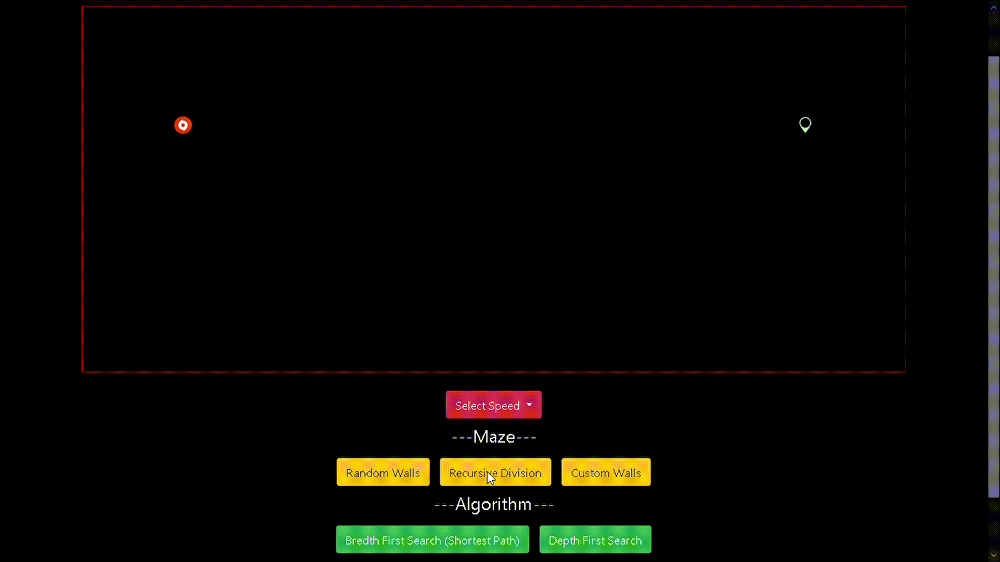
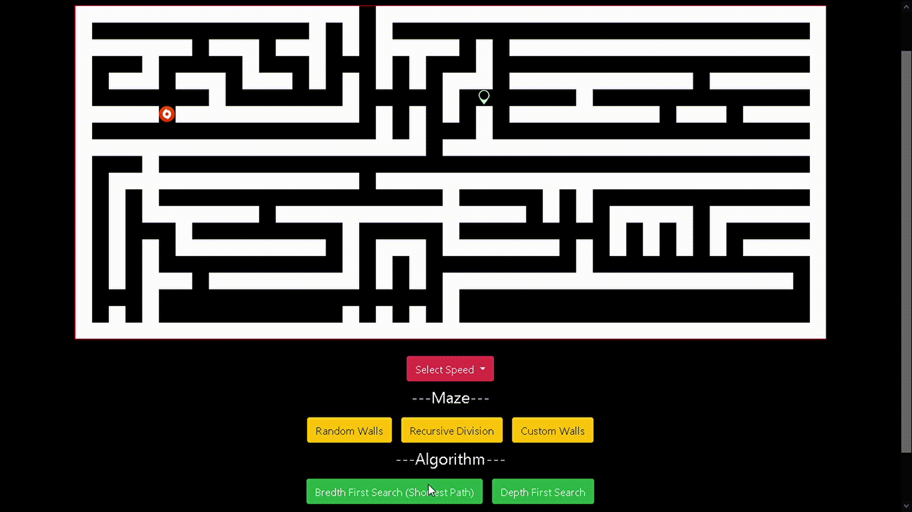

# Path Finder Visualizer
This is a web page which helps in visualizing Breadth First Search and Depth First Search Algorithms by searching for a target inside a maze. The maze and the algorithms are visualized using HTML `<table>`. 

###### Breadth First Search	
Breadth-first search is an algorithm for traversing or searching tree or graph data structures. It starts at the tree root, and explores all of the neighbor nodes at the present depth prior to moving on to the nodes at the next depth level. https://en.wikipedia.org/wiki/Breadth-first_search

###### Depth First Seach
Depth-first search is an algorithm for traversing or searching tree or graph data structures. The algorithm starts at the root node and explores as far as possible along each branch before backtracking. https://en.wikipedia.org/wiki/Depth-first_search

###### Maze Gnereation
At each step, the algorithm bisects a area horizontally or vertically and then leaves a random position in the bisection open so that the divided regions still remains connected.

# Demo

#### Maze Generation Algorithm

<!--  -->

#### Breadth First Search - PATH FINDING

<!--  -->

